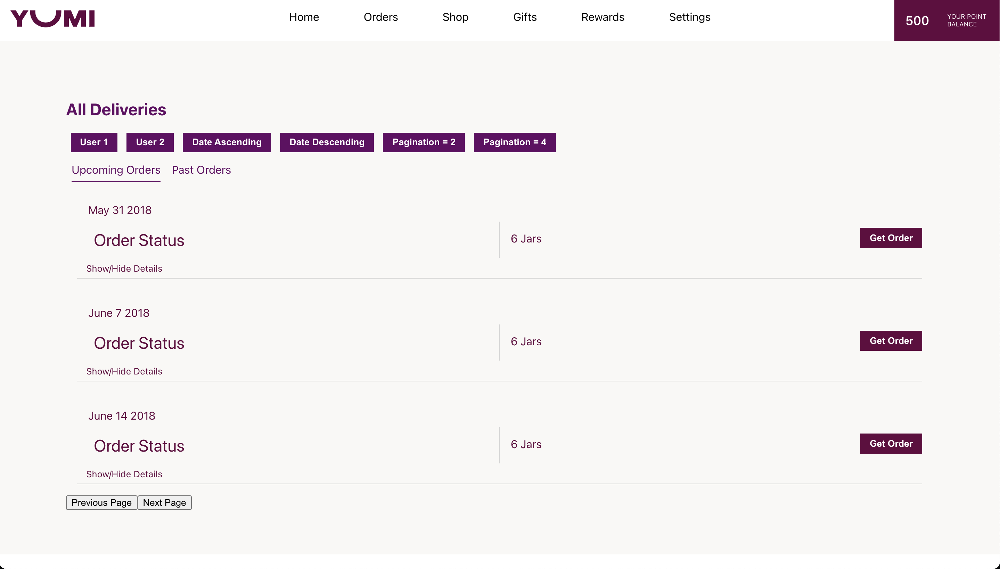
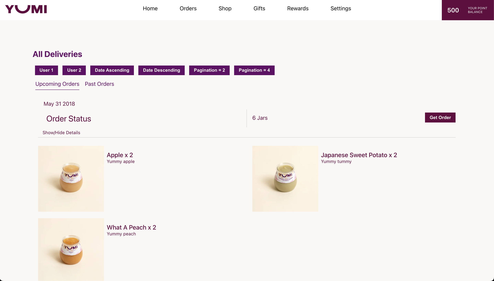
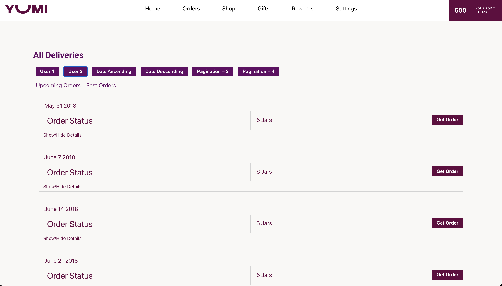
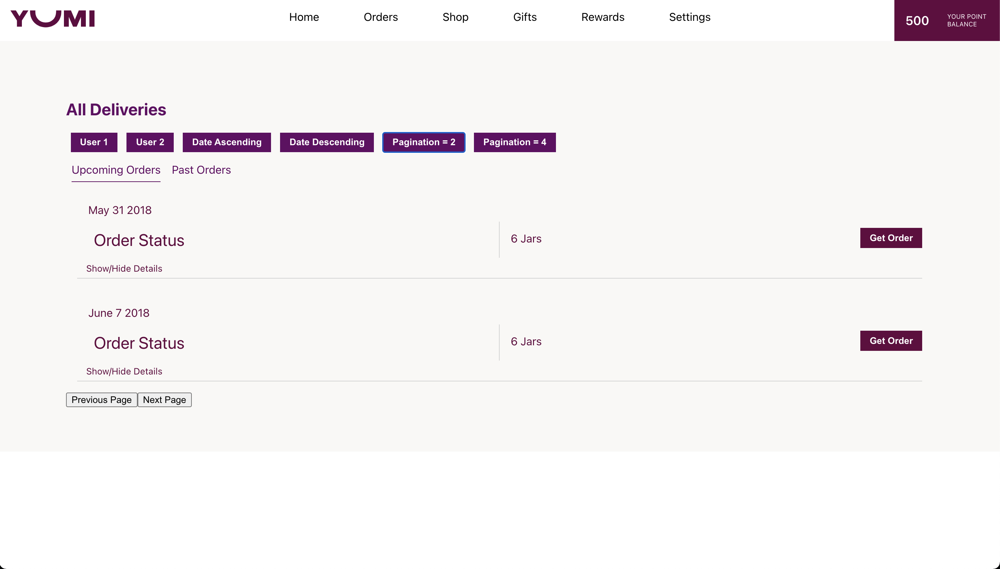
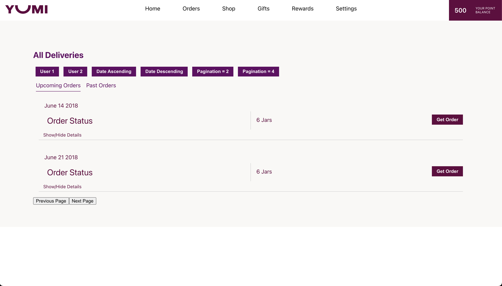
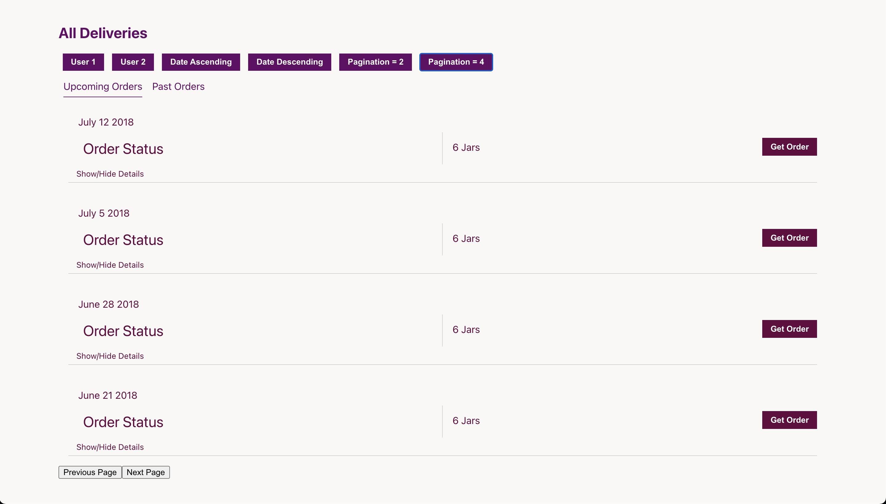

# Yumi Test

## Introduction
This is a basic orders view created on the `/api/v1/orders` endpoint. This view enables
1. Selecting which user's orders are shown
2. Sorting these orders based on their delivery dates
3. Paginating the results to 2 or 4 per page
4. Navigating the pages of the paginated results

## Technologies Used
### Frontend
1. React
1. Sass

### Backend
1. Node.js
2. Knex
3. Mysql

## Setup
1. Clone this repository.
2. Configure the `.env` and `frontend/.env` files.
3. Run `npm start`

## Screenshots

View on landing

Order's details opened

Showing User 2's orders

Orders of user 2 with orders 2 per page, sorted in an ascending manner based on delivery date

Orders of user 2 with orders 2 per page, sorted in an descending manner based on delivery date

Orders of user 2 with orders 4 per page, sorted in an descending manner based on delivery date

## Improvements
### Frontend Improvements
1. Sass theming that could be modularized
2. A better classNames convention for managing classes
4. Past Orders and Upcoming Orders logic based on order status
5. Prop validations in all components
6. Refactoring file and folder structure
7. Version control
    1. Better branching
    2. Better commit structure
8. Eslint - dealing with all the suppressed errors
9. More robust error handling
10. Sass themeing

### Backend Improvements
1. A better SQL query constructor
    1. ORM → Sequelize
    2. FeathersJS for real-time
2. More refactoring for maintainability
3. More robust error handling
4. Running ESLint on backend